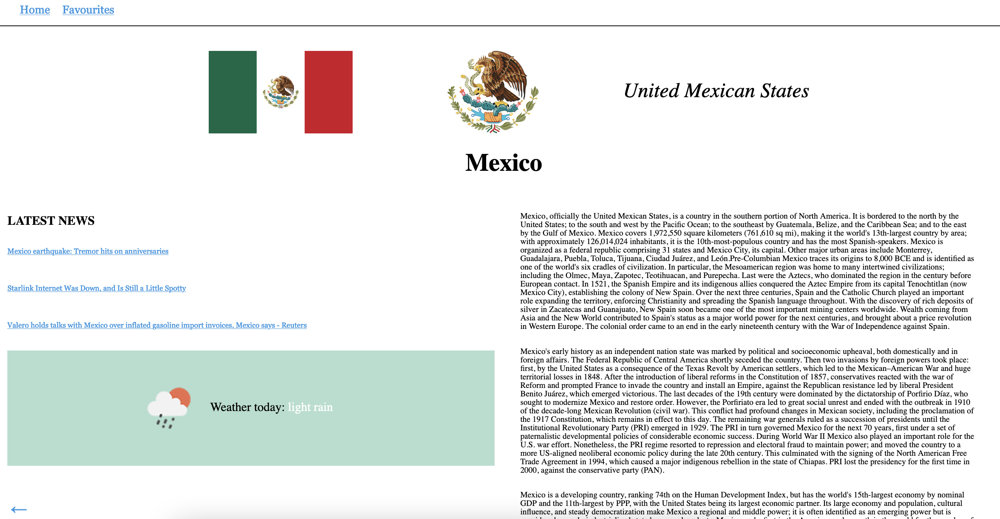

# Countires App



School project done in BCH during Web Dev Studies in Autumn 2022. An app that lists countries and fetches some data about weather and latest news + country related text from Wikipedia.

Site is deployed live here:
https://countries-redux-react.netlify.app/

## Tech used

- React
- Redux

## Getting started

```cli
npm install
npm start
```

## Localstorage + Redux

Redux looks up if there is allready some data stored about favourite countries to localstorage in favouriteSlice.js:

```js
const favouritesSlice = createSlice({
  name: "favourites",
  initialState: {
    favourites: localStorage.favourites
      ? JSON.parse(localStorage.favourites).favourites
      : [],
  },
});
```

When adding or deleting favourite countries from the list, the list will be updated and added to localstorage in store/index.js:

```js
let currentValue = store.getState().favourites;

store.subscribe(() => {
  let previousValue = currentValue;
  currentValue = store.getState().favourites;

  if (previousValue !== currentValue) {
    localStorage.setItem("favourites", JSON.stringify(currentValue));
  }
});
```

## API's used

- REST countries: https://restcountries.com/
- MediaWiki: https://www.mediawiki.org/wiki/API:Main_page
- OpenWeather: https://openweathermap.org/api NB! Needs an api key that user gets after registration at openweathermap.org; once recieving the key, create an .env file in the project root and store it there:

```
REACT_APP_API_KEY_NEWS=YOUR_NEW_API_KEY_FOR_WEATHER
```

- NEWSDATA.IO: https://newsdata.io/ NB! By default the app uses dummy data from src/components/sampleApi.js; to use newsdata.io, user needs an api key that user gets after registration at newsdata.io. Newsdata.io provides a number of free api calls. After recieving the api key, store it in .env:

```
REACT_APP_API_KEY=YOU_NEW_API_KEY_FOR_NEWS
```

The key will be called in getNews() in src/components/CountrySingle.js. Uncomment the axios call when wanting to use it. If still some problems, check newsdata.io documentation.

## LICENCE

MIT licence
